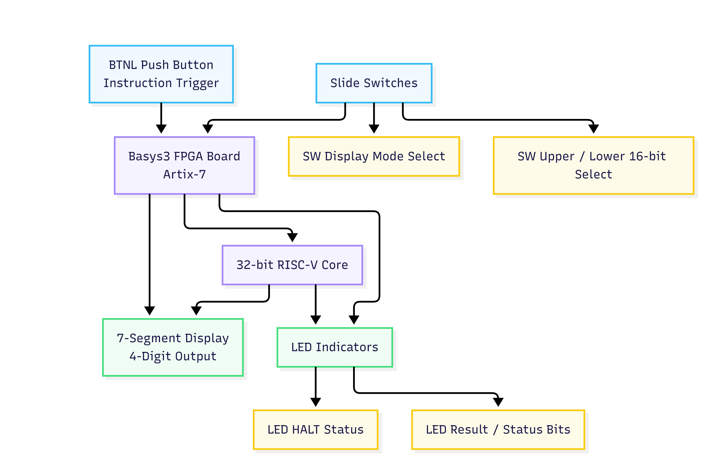
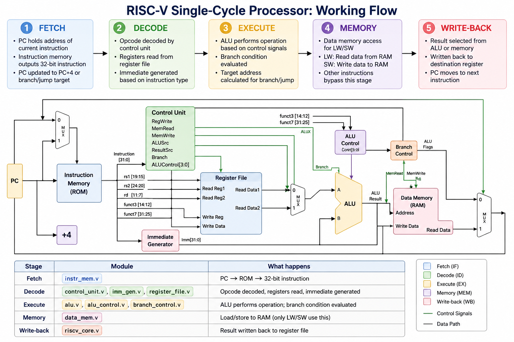
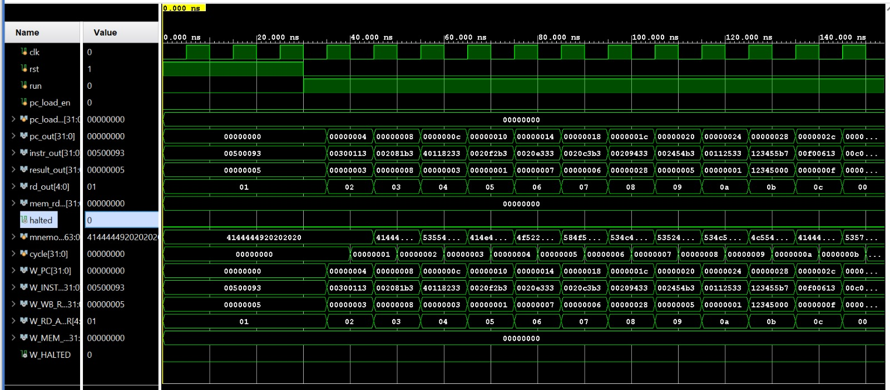

# RISC-V Processor Design using Verilog

## Overview
This project implements a basic RISC-V processor using Verilog HDL. The processor is designed using a modular architecture and includes essential components such as the ALU, Control Unit, Register File, Instruction Memory, Data Memory, Immediate Generator, and Branch Control Unit.

The design is functionally verified using Verilog testbenches and is targeted for FPGA implementation using the Basys3 development board in Vivado.

---

## Features
- Modular RISC-V processor architecture
- Arithmetic Logic Unit (ALU)
- Instruction decoding using Control Unit
- Register File implementation
- Instruction and Data Memory modules
- Immediate value generation
- Branch control logic
- FPGA compatible design
- Functional simulation support
- Seven segment display support

---

## Technologies Used
- Verilog HDL
- Vivado
- FPGA Design
- Digital System Design

---

## Repository Structure

```text
RISCV-Processor-Verilog/
│
├── README.md
├── LICENSE
│
├── src/
│   ├── alu.v
│   ├── alu_control.v
│   ├── branch_control.v
│   ├── control_unit.v
│   ├── data_mem.v
│   ├── imm_gen.v
│   ├── instr_mem.v
│   ├── register_file.v
│   ├── riscv_core.v
│   ├── seg7.v
│   └── top.v
│
├── testbench/
│   ├── tb_top.v
│   └── tb_riscv_core_new.v
│
├── constraints/
│   └── basys3.xdc
│
├── images/
│   ├── waveform.png
│   ├── hardware_connection_diagram.png
│   └── riscv_processor_workflow.png
│
└── docs/
    └── project_report.pdf
```

---

## Module Description

### ALU (`alu.v`)
Performs arithmetic and logical operations required by the processor.

### ALU Control (`alu_control.v`)
Generates ALU control signals based on instruction type.

### Control Unit (`control_unit.v`)
Decodes instructions and generates processor control signals.

### Register File (`register_file.v`)
Stores processor registers and handles read/write operations.

### Instruction Memory (`instr_mem.v`)
Stores program instructions executed by the processor.

### Data Memory (`data_mem.v`)
Handles data storage operations during execution.

### Immediate Generator (`imm_gen.v`)
Extracts and generates immediate values from instructions.

### Branch Control (`branch_control.v`)
Controls branching decisions during execution.

### RISC-V Core (`riscv_core.v`)
Main processor integration module.

### Top Module (`top.v`)
Top-level module used for FPGA implementation.

### Seven Segment Display (`seg7.v`)
Controls seven-segment display output on the FPGA board.

### Testbenches
- `tb_top.v`
- `tb_riscv_core_new.v`

Used for functional verification and simulation of the processor.

---

## Hardware Connection Diagram



---

## Processor Workflow



---

## Simulation Waveform



---

## FPGA Implementation
The project is targeted for implementation on the Basys3 FPGA development board using the provided constraint file.

---

## Applications
- Computer Architecture Learning
- FPGA-based Processor Design
- Embedded Systems
- Digital System Design Education
- RISC-V Architecture Study

---

## How to Run the Project

### Using Vivado
1. Open Vivado
2. Create a new project
3. Add all Verilog source files from the `src/` folder
4. Add testbench files from the `testbench/` folder
5. Add `basys3.xdc` constraints file
6. Run behavioral simulation
7. Run synthesis and implementation for FPGA deployment

---

## Future Improvements
- Pipeline implementation
- Hazard detection and forwarding
- Cache memory integration
- UART communication support
- Extended RISC-V instruction support

---

## Author
M. Likhitha Reddy

---

## License
This project is licensed under the MIT License.
